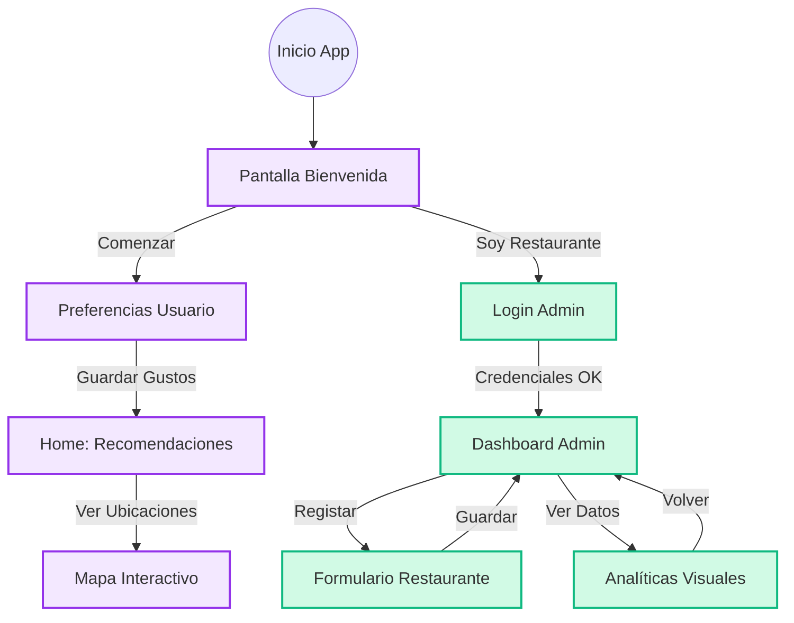

# Documentación del Proyecto: Travelyx 🐙

**Travelyx** es una aplicación móvil híbrida (Ionic/Angular) diseñada como una guía turística virtual inteligente. Su objetivo es recomendar restaurantes y lugares de interés basados en las preferencias personalizadas del usuario, guiados por el asistente virtual "Polly".

---

## 1. Visión General 🔭
La aplicación conecta a turistas con experiencias gastronómicas locales.
*   **Para el Turista:** Una experiencia gamificada para descubrir dónde comer sin complicaciones.
*   **Para el Restaurante:** Una plataforma administrativa para gestionar su visibilidad y analizar su rendimiento.

---

## 2. Arquitectura Técnica 🏗️
El proyecto está construido utilizando tecnologías web modernas optimizadas para móviles:

*   **Framework:** Ionic 7 + Angular 17+ (Standalone Components).
*   **Lenguaje:** TypeScript.
*   **Estilos:** SCSS (Sass) con variables CSS globales para el tema.
*   **Iconos:** Ionicons.
*   **Gestión de Estado:** Servicios de Angular (Pendiente de implementación completa para persistencia).

### Estructura de Carpetas Principal (`src/app`)
*   `/home`: Pantalla principal de recomendaciones para el usuario.
*   `/pages`:
    *   `/welcome`: Pantalla de inicio y bienvenida.
    *   `/preferences`: Asistente de configuración de gustos (2 pasos).
    *   `/map`: Vista de mapa (actualmente simulada).
    *   `/login` & `/register`: Módulo de autenticación.
    *   `/admin`: Módulo de gestión para restaurantes.
        *   `/dashboard`: Lista de restaurantes.
        *   `/analytics`: Estadísticas visuales.
        *   `/restaurant-form`: Crear/Editar restaurante.

---

## 3. Diagrama de Flujo (Navegación) 🔄



## 4. Funcionalidades Clave ✨

### Flujo de Usuario (Turista)
1.  **Bienvenida:** Pantalla atractiva con "Polly" (el pulpo mascota) animado.
2.  **Preferencias:** Selección rápida de tipo de comida, presupuesto y ambiente.
3.  **Recomendaciones (Home):** Lista curada de restaurantes basada en las preferencias.
4.  **Mapa:** Visualización de la ubicación de los lugares seleccionados.

### Flujo de Administrador (Restaurante)
1.  **Acceso:** Login exclusivo para administradores.
2.  **Dashboard:**
    *   Visualización rápida de estado (Vacío vs Lista).
    *   Acceso directo a analíticas ("Ver Estadísticas").
3.  **Gestión (CRUD):** Formulario para registrar nombre, tipo, fotos y precios.
4.  **Analíticas:**
    *   Gráficos visuales (Barras y Donut) sobre vistas e interacción.
    *   KPIs de rendimiento.

---

## 5. Sistema de Diseño 🎨
Se ha implementado un diseño "Premium" y "Vistoso":

*   **Paleta de Colores:**
    *   🟣 **Primario (Polly):** Tonos Púrpuras/Violetas (`#a855f7` - `#9333ea`) para la experiencia de usuario.
    *   🟢 **Secundario (Auth):** Tonos Esmeralda (`#10b981`) para confianza y seguridad.
*   **Tipografía:** Fuentes modernas sans-serif (Inter/Roboto).
*   **Animaciones:**
    *   `fade-in-up`: Entrada escalonada de tarjetas.
    *   `pulse`: Llamadas a la acción.
    *   Transiciones suaves entre páginas.

---

## 6. Guía de Instalación y Ejecución 🚀

### Requisitos Previos
*   Node.js (LTS).
*   Ionic CLI: `npm install -g @ionic/cli`.

### Pasos
1.  **Clonar el repositorio:**
    ```bash
    git clone <url-del-repo>
    cd travelyx
    ```
2.  **Instalar dependencias:**
    ```bash
    npm install
    ```
3.  **Ejecutar en desarrollo:**
    ```bash
    ionic serve
    ```
    La aplicación se abrirá en `http://localhost:8100`.

---

## 7. Próximos Pasos (Roadmap) 🗺️
Para llevar la aplicación a producción (Versión 1.0), se recomienda:

1.  **Backend:** Implementar base de datos (Firebase/Supabase) para persistencia real.
2.  **Mapas:** Integrar Google Maps SDK o Mapbox.
3.  **Cámara:** Usar Capacitor Camera para subir fotos reales.
