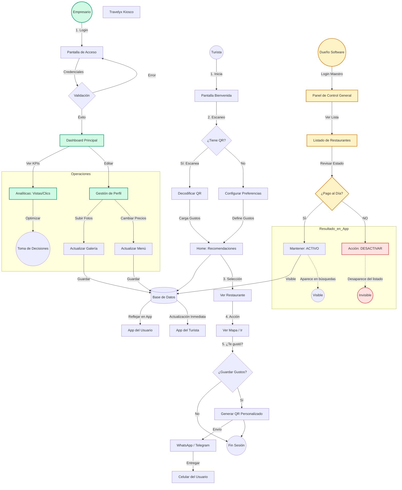

# REPORTE DE PROCESOS Y FUNCIONALIDAD CLAVE: TRAVELYX

**OBJETIVO:** Describir detalladamente las funciones principales del sistema y analizar el flujo de sus procesos operativos integrales, cubriendo la interacción entre Turista, Empresario y Administración Central.

---

## 1. FUNCIONALIDAD CLAVE DEL SISTEMA 🔑

Travelyx opera como un ecosistema digital inteligente que conecta tres pilares fundamentales:

### A. Para el Turista (Usuario Final)
*   **Asistente Virtual "Polly":** Guía que personaliza la experiencia.
*   **Filtrado Inteligente:** Algoritmo que cruza *Antojo*, *Presupuesto* y *Ambiente*.
*   **Portabilidad (QR):** Permite llevar las preferencias en el celular y activarlas en cualquier kiosco.

### B. Para el Empresario (Restaurante)
*   **Gestión Comercial:** Control total de su menú y perfil digital.
*   **Inteligencia de Datos:** Dashboard con métricas reales de impacto (vistas/clics) para tomar decisiones.

### C. Para el Dueño del Software (Super Admin)
*   **Gestión Centralizada:** Panel maestro para administrar todas las cuentas de empresarios.
*   **Control de Monetización (Paywall):** Sistema de bloqueo instantáneo ("Kill Switch") que oculta a los restaurantes que no cumplen con los acuerdos económicos, incentivando el pago sin perder datos históricos.

---

## 2. DIAGRAMA DE FLUJO GENERAL DEL SISTEMA 🔄

El siguiente diagrama unificado representa la totalidad de las interacciones del sistema Travelyx.

---

## 3. ANÁLISIS INTEGRAL DE LOS PROCESOS ⚙️

Este diagrama revela la **interconexión vital** del sistema Travelyx:

### I. La Base de Datos como Núcleo (Hub Central)
Observe cómo el nodo **DB [(Base de Datos)]** recibe información de tres fuentes distintas simultáneamente:
1.  **Del Empresario:** Información de menús y precios (`Update1`, `Update2`).
2.  **Del Turista:** Consultas para recomendaciones (`Home --> DB`).
3.  **Del Super Admin:** Estados de visibilidad (`KeepActive --> DB`).

### II. Flujo de Valor y Monetización
El sistema garantiza que el valor fluya en ambas direcciones, pero introduce un "cuello de botella" controlado por el Super Admin:
*   Si el empresario paga, el flujo `DB --> AppTurista` se mantiene abierto (Visible).
*   Si no paga, el flujo se corta (Invisible), protegiendo el modelo de negocio del software.

### III. Ciclo de Vida del Usuario (Retention Loop)
El diagrama del turista muestra claramente el ciclo de fidelización:
Inicio -> Experiencia (Valor) -> Generación de QR (Retención) -> Reingreso (Portabilidad).
Esto transforma a usuarios ocasionales en usuarios recurrentes, aumentando el valor de la plataforma para los restaurantes suscritos.
